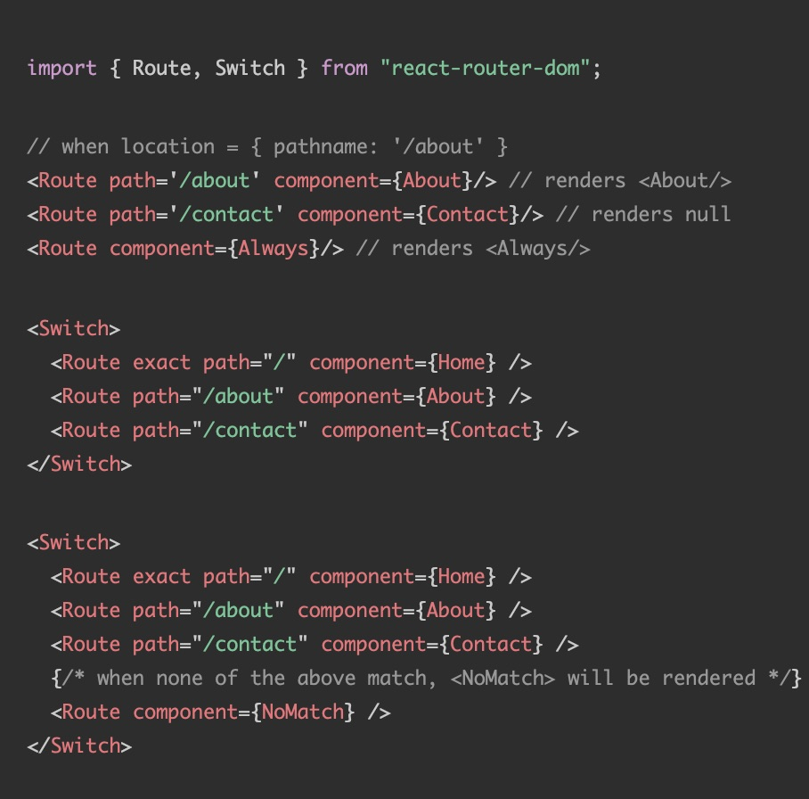

React Router:

  - [Github](https://github.com/ReactTraining/react-router)
  - [Docs](https://reacttraining.com/react-router/)

## Basic usage

Imports. 

```javascript
import React from "react";
import { BrowserRouter as Router, Route, Link } from "react-router-dom";
```

BrowserRouter is the browser version of this router that can also work on React Native.

This has to wrap the whole app, allowing ```Route``` to be triggered and ```Links``` to work when clicked.

```html
 return (
    <Router>
        ...
        <Link to="/">Home</Link>

        ...
        <Route exact path="/" component={Home}>
 )
```

## Route params matching

Using Route Component

```html
        <Route path="/:id" component={Child} />
```

React code

```javascript
function Child({ match }) {
  return (
    <div>
      <h3>ID: {match.params.id}</h3>
    </div>
  );
}
```

## Authentication


  <Route
      {...rest}
      render={props =>
        fakeAuth.isAuthenticated ? (
          <Component {...props} />
        ) : (
          <Redirect to={{ pathname: "/login",   state: { from: props.location }}}/>
        )
      }
    />


Redirect is cool - it redirects when rendered

## Not found

Route without path is always matched

```html
  <Route component={NoMatch} />
```

Route with ```exact``` will match only if the path is exactly the same.


## Query Params 

```javascript
function ParamsExample({ location }) {
  let params = new URLSearchParams(location.search);
}
```

These need to be extracted from the location

URLSearchParams comes from the [Browser's URL API](https://developer.mozilla.org/en-US/docs/Web/API/URL)

## Route matching



## Still to investigate

- State management integration [Redux](https://reacttraining.com/react-router/web/guides/redux-integration)
- [Update Blocking](https://reacttraining.com/react-router/web/guides/dealing-with-update-blocking)

## Other cheatsheets

- [https://devhints.io/react-router](https://devhints.io/react-router)